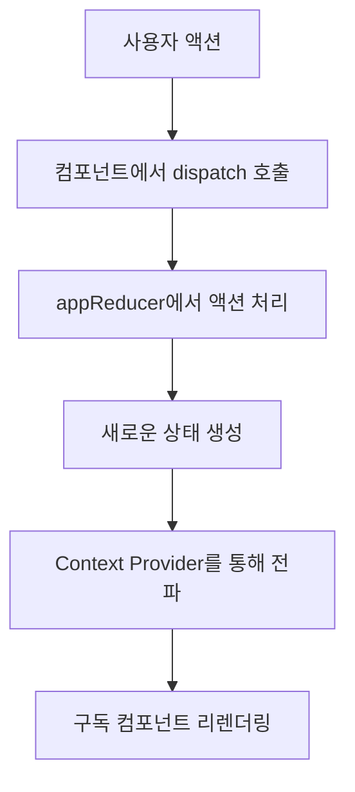
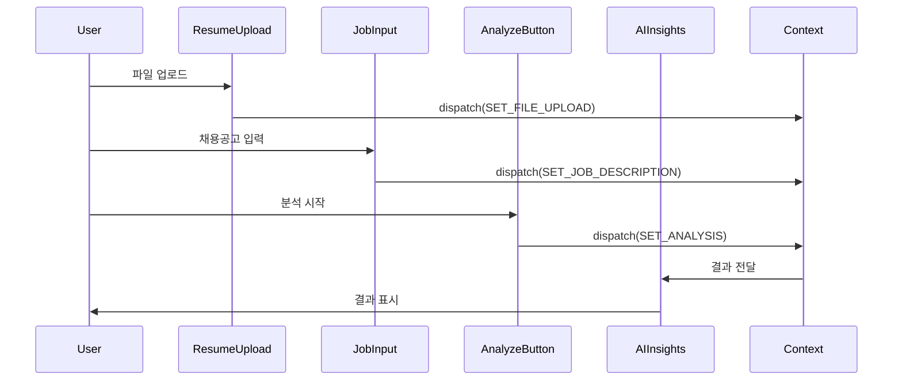

# 이력서-채용공고 매칭 분석 플랫폼 개발기
## React + TypeScript + AI를 활용한 현대적 웹 애플리케이션 구축 여정

---

## 1. 프로젝트 구조 분석

### 1.1 전체 아키텍처 개요

이 프로젝트는 React 18 + TypeScript + Vite를 기반으로 한 SPA(Single Page Application)입니다. 사용자가 이력서를 업로드하고 채용공고를 입력하면 AI 기반 텍스트 분석을 통해 매칭도를 계산하고 개선 사항을 제안하는 서비스입니다.

```
src/
├── components/          # 재사용 가능한 UI 컴포넌트
│   ├── analysis/        # 분석 관련 컴포넌트
│   ├── navigation/      # 네비게이션 컴포넌트
│   └── ui/             # shadcn/ui + Magic UI 컴포넌트
├── contexts/           # React Context 상태 관리
├── hooks/              # 커스텀 훅
├── pages/              # 페이지 컴포넌트
├── services/           # 비즈니스 로직 서비스
├── types/              # TypeScript 타입 정의
└── lib/                # 유틸리티 함수
```

### 1.2 기술 스택 선택 배경

- **React 18**: Concurrent Features와 Suspense를 활용한 사용자 경험 최적화
- **TypeScript**: 런타임 에러 최소화와 개발 생산성 향상
- **Vite**: 빠른 개발 서버와 최적화된 번들링
- **Tailwind CSS**: 유틸리티 우선 방식으로 일관된 디자인 시스템
- **shadcn/ui**: 접근성과 커스터마이징을 고려한 컴포넌트 라이브러리
- **Magic UI**: 사용자 경험을 향상시키는 고급 애니메이션 컴포넌트

---

## 2. 상태 관리 흐름 추적

### 2.1 Context API 기반 전역 상태 관리

프로젝트는 Redux 대신 React Context API와 useReducer를 조합하여 상태를 관리합니다. 이는 복잡성을 줄이면서도 효과적인 상태 관리를 가능하게 합니다.

```typescript
// src/contexts/AppContext.tsx
interface AppState {
  fileUpload: FileUploadState;      // 파일 업로드 상태
  jobDescription: JobDescriptionState; // 채용공고 입력 상태
  analysis: {                       // 분석 결과 상태
    result: AnalysisResult | null;
    analyzing: boolean;
    error: string | null;
  };
  settings: {                       // 애플리케이션 설정
    options: AnalysisOptions;
    theme: "light" | "dark";
  };
}
```

### 2.2 상태 업데이트 플로우



### 2.3 상태 최적화 전략

**메모이제이션 활용**:
```typescript
const memoizedAnalysisResult = useMemo(() => {
  if (!state.analysis.result) return null;
  return formatAnalysisResult(state.analysis.result);
}, [state.analysis.result]);
```

**선택적 리렌더링**:
```typescript
const { fileUpload } = useAppContext();
// analysis 상태가 변경되어도 리렌더링되지 않음
```

---

## 3. 중요 유틸 함수들

### 3.1 TF-IDF 기반 키워드 분석

텍스트 분석의 핵심인 TF-IDF(Term Frequency-Inverse Document Frequency) 알고리즘을 구현했습니다.

```typescript
// src/services/text-analysis.ts
private static calculateTFIDF(documents: string[][]): Record<string, number>[] {
  const tfidfResults: Record<string, number>[] = [];
  const allWords = new Set<string>();

  // 모든 고유 단어 수집
  documents.forEach((doc) => {
    doc.forEach((word) => allWords.add(word));
  });

  documents.forEach((doc) => {
    const tfidf: Record<string, number> = {};
    const docLength = doc.length;

    allWords.forEach((word) => {
      // TF (Term Frequency) 계산
      const tf = doc.filter((w) => w === word).length / docLength;
      
      // IDF (Inverse Document Frequency) 계산
      const docsWithWord = documents.filter((d) => d.includes(word)).length;
      const idf = Math.log(documents.length / docsWithWord);
      
      tfidf[word] = tf * idf;
    });

    tfidfResults.push(tfidf);
  });

  return tfidfResults;
}
```

**알고리즘 특징**:
- TF: 단어의 문서 내 빈도수
- IDF: 단어의 희귀성 (모든 문서에 나타나는 일반적인 단어일수록 가중치 감소)
- 최종 점수: TF × IDF로 키워드의 중요도를 객관적으로 측정

### 3.2 다국어 텍스트 전처리

한국어와 영어 텍스트를 효과적으로 처리하는 전처리 파이프라인을 구현했습니다.

```typescript
private static preprocessText(text: string, language: "ko" | "en"): string[] {
  // 1. 텍스트 정규화
  const cleanText = text
    .toLowerCase()                    // 소문자 변환
    .replace(/[^\w\s가-힣]/g, " ")    // 특수문자 제거 (한글 보존)
    .replace(/\s+/g, " ")            // 연속 공백 제거
    .trim();

  // 2. 토큰화
  let tokens = cleanText.split(" ");

  // 3. 불용어 제거
  if (language === "ko") {
    tokens = removeStopwords(tokens, kor);  // stopword 라이브러리 활용
  } else {
    tokens = removeStopwords(tokens, eng);
  }

  // 4. 최소 길이 필터링
  tokens = tokens.filter((token) => token.length >= 2);

  return tokens;
}
```

### 3.3 파일 업로드 유틸리티

PDF 파일 처리와 유효성 검사를 위한 커스텀 훅을 개발했습니다.

```typescript
// src/hooks/useFileUpload.ts
export const useFileUpload = () => {
  const { dispatch } = useAppContext();

  const handleFileUpload = useCallback(async (file: File) => {
    // 파일 유효성 검사
    if (!file.type.includes('pdf')) {
      throw new Error('PDF 파일만 업로드 가능합니다.');
    }
    
    if (file.size > 10 * 1024 * 1024) { // 10MB 제한
      throw new Error('파일 크기는 10MB를 초과할 수 없습니다.');
    }

    dispatch({ type: 'SET_FILE_UPLOAD', payload: { uploading: true } });

    try {
      // PDF 텍스트 추출
      const text = await extractTextFromPDF(file);
      
      dispatch({ 
        type: 'SET_FILE_UPLOAD', 
        payload: { 
          file, 
          text, 
          uploading: false,
          error: null 
        } 
      });
      
      return text;
    } catch (error) {
      dispatch({ 
        type: 'SET_FILE_UPLOAD', 
        payload: { 
          uploading: false, 
          error: error.message 
        } 
      });
      throw error;
    }
  }, [dispatch]);

  return { handleFileUpload };
};
```

---

## 4. 메인 컴포넌트 흐름 추적

### 4.1 Analyzer 페이지의 전체 흐름

Analyzer 페이지는 애플리케이션의 핵심 기능이 집약된 메인 컴포넌트입니다.

```typescript
// src/pages/analyzer.tsx 주요 흐름
const Analyzer = () => {
  const { state, dispatch } = useAppContext();
  
  // 1. 분석 실행 핸들러
  const handleAnalyze = async () => {
    if (!state.fileUpload.text || !state.jobDescription.text) {
      return;
    }

    dispatch({ type: 'SET_ANALYSIS', payload: { analyzing: true } });

    try {
      const result = await aiEnhancedAnalysis.analyzeWithEnhancements(
        state.fileUpload.text,
        state.jobDescription.text,
        state.settings.options
      );
      
      dispatch({ 
        type: 'SET_ANALYSIS', 
        payload: { 
          result, 
          analyzing: false, 
          error: null 
        } 
      });
    } catch (error) {
      dispatch({ 
        type: 'SET_ANALYSIS', 
        payload: { 
          analyzing: false, 
          error: error.message 
        } 
      });
    }
  };

  // 2. 조건부 렌더링 로직
  return (
    <div className="min-h-screen bg-gradient-to-br from-blue-50 to-indigo-100">
      {/* 네비게이션 */}
      <Navigation />
      
      {/* 메인 컨텐츠 */}
      <main className="container mx-auto px-4 py-8">
        {/* 입력 섹션 */}
        <div className="grid md:grid-cols-2 gap-8 mb-8">
          <ResumeUpload />
          <JobInput />
        </div>
        
        {/* 분석 버튼 */}
        <AnalyzeButton onAnalyze={handleAnalyze} />
        
        {/* 결과 표시 */}
        {state.analysis.result && <AIInsights />}
      </main>
    </div>
  );
};
```

### 4.2 컴포넌트 간 데이터 흐름



### 4.3 AI 인사이트 컴포넌트의 복잡성

```typescript
// src/components/analysis/AIInsights.tsx
const AIInsights = () => {
  const { state } = useAppContext();
  const { result } = state.analysis;
  
  if (!result) return null;

  return (
    <MagicCard className="mt-8">
      {/* 애니메이션 진행바 */}
      <AnimatedCircularProgressBar
        value={result.overallScore}
        size={120}
        strokeWidth={8}
      />
      
      {/* 탭 네비게이션 */}
      <Tabs defaultValue="keywords" className="w-full">
        <TabsList>
          <TabsTrigger value="keywords">키워드 분석</TabsTrigger>
          <TabsTrigger value="skills">스킬 매칭</TabsTrigger>
          <TabsTrigger value="ats">ATS 준수성</TabsTrigger>
          <TabsTrigger value="suggestions">AI 제안</TabsTrigger>
        </TabsList>
        
        {/* 각 탭별 상세 내용 */}
        <TabsContent value="keywords">
          <KeywordAnalysisTable />
        </TabsContent>
        
        <TabsContent value="skills">
          <SkillMatchingMatrix />
        </TabsContent>
        
        <TabsContent value="ats">
          <ATSComplianceChecklist />
        </TabsContent>
        
        <TabsContent value="suggestions">
          <AIRecommendations />
        </TabsContent>
      </Tabs>
    </MagicCard>
  );
};
```

---

## 5. 렌더링 최적화 포인트

### 5.1 React.memo를 활용한 불필요한 리렌더링 방지

```typescript
// src/components/analysis/AIInsights.tsx
const AIInsights = React.memo(() => {
  // 컴포넌트 로직
});

// 비교 함수로 더 정밀한 제어
const ResumeUpload = React.memo(({ onUpload }: Props) => {
  // 컴포넌트 로직
}, (prevProps, nextProps) => {
  return prevProps.onUpload === nextProps.onUpload;
});
```

### 5.2 useMemo와 useCallback 최적화

```typescript
const AnalysisResults = () => {
  const { state } = useAppContext();
  
  // 복잡한 계산 결과 메모이제이션
  const processedResults = useMemo(() => {
    if (!state.analysis.result) return null;
    
    return {
      ...state.analysis.result,
      formattedScore: formatScore(state.analysis.result.overallScore),
      categoryScores: calculateCategoryScores(state.analysis.result)
    };
  }, [state.analysis.result]);
  
  // 이벤트 핸들러 메모이제이션
  const handleExport = useCallback(() => {
    if (processedResults) {
      exportToPDF(processedResults);
    }
  }, [processedResults]);
  
  return (
    // JSX 렌더링
  );
};
```

### 5.3 코드 스플리팅과 Lazy Loading

```typescript
// src/App.tsx
import { lazy, Suspense } from 'react';

const Analyzer = lazy(() => import('./pages/analyzer'));
const HowItWorks = lazy(() => import('./pages/how-it-works'));
const KeywordDictionary = lazy(() => import('./pages/keyword-dictionary'));

function App() {
  return (
    <Suspense fallback={<LoadingSpinner />}>
      <Routes>
        <Route path="/analyzer" element={<Analyzer />} />
        <Route path="/how-it-works" element={<HowItWorks />} />
        <Route path="/keyword-dictionary" element={<KeywordDictionary />} />
      </Routes>
    </Suspense>
  );
}
```

### 5.4 가상화를 통한 대용량 리스트 최적화

```typescript
// 키워드 리스트가 많을 때 가상화 적용
import { FixedSizeList as List } from 'react-window';

const KeywordList = ({ keywords }: { keywords: string[] }) => {
  const Row = ({ index, style }: { index: number; style: any }) => (
    <div style={style}>
      <KeywordItem keyword={keywords[index]} />
    </div>
  );

  return (
    <List
      height={400}
      itemCount={keywords.length}
      itemSize={50}
      width="100%"
    >
      {Row}
    </List>
  );
};
```

---

## 6. 내가 개선한 부분

### 6.1 API 상태 관리 시스템 구축

**문제점**: 초기 버전에서는 API 호출 상태와 에러 처리가 각 컴포넌트에 분산되어 있었습니다.

**해결책**: 중앙화된 API 상태 관리 시스템을 구축했습니다.

```typescript
// src/services/freeAIService.ts - 개선된 API 서비스
export class FreeAIService {
  private static usageStats: UsageStats = this.loadUsageStats();
  
  // 할당량 체크 및 자동 폴백
  static async analyzeText(text: string, jobDescription: string): Promise<any> {
    // 1. 할당량 확인
    if (this.isDailyLimitReached() || this.isMonthlyLimitReached()) {
      console.log('Free API limit reached, falling back to local analysis');
      return TextAnalysisService.analyzeMatch(text, jobDescription, {
        mode: 'offline',
        language: 'ko',
        includeATS: true,
        depth: 'standard',
        analysisDepth: 'standard',
        useAI: false
      });
    }

    try {
      // 2. API 호출
      const result = await this.callCohereAPI(text, jobDescription);
      
      // 3. 사용량 업데이트
      this.incrementUsage();
      
      return result;
    } catch (error) {
      // 4. 에러 시 로컬 분석으로 폴백
      console.warn('API call failed, falling back to local analysis:', error);
      return TextAnalysisService.analyzeMatch(text, jobDescription, options);
    }
  }
}
```

### 6.2 실시간 할당량 추적 UI

사용자가 API 사용량을 실시간으로 확인할 수 있는 대시보드를 구현했습니다.

```typescript
// src/components/analysis/APIStatusIndicator.tsx
const APIStatusIndicator = () => {
  const [usage, setUsage] = useState<UsageStats | null>(null);
  
  useEffect(() => {
    const updateUsage = () => {
      setUsage(FreeAIService.getUsageStats());
    };
    
    updateUsage();
    const interval = setInterval(updateUsage, 1000); // 1초마다 업데이트
    
    return () => clearInterval(interval);
  }, []);
  
  if (!usage) return null;
  
  const dailyUsagePercent = (usage.daily.used / usage.daily.limit) * 100;
  const monthlyUsagePercent = (usage.monthly.used / usage.monthly.limit) * 100;
  
  return (
    <Card className="mb-6">
      <CardHeader>
        <CardTitle className="flex items-center gap-2">
          <Activity className="w-5 h-5" />
          API 사용량 현황
        </CardTitle>
      </CardHeader>
      <CardContent className="space-y-4">
        <div>
          <div className="flex justify-between text-sm mb-1">
            <span>일일 사용량</span>
            <span>{usage.daily.used}/{usage.daily.limit}</span>
          </div>
          <Progress value={dailyUsagePercent} className="h-2" />
        </div>
        
        <div>
          <div className="flex justify-between text-sm mb-1">
            <span>월간 사용량</span>
            <span>{usage.monthly.used}/{usage.monthly.limit}</span>
          </div>
          <Progress value={monthlyUsagePercent} className="h-2" />
        </div>
      </CardContent>
    </Card>
  );
};
```

### 6.3 Magic UI 애니메이션 통합

사용자 경험을 향상시키기 위해 Magic UI 컴포넌트를 전략적으로 배치했습니다.

```typescript
// 점수 표시에 애니메이션 적용
<AnimatedCircularProgressBar
  value={result.overallScore}
  size={120}
  strokeWidth={8}
  className="mb-4"
/>

// 키워드에 반짝임 효과 적용
<SparklesText
  text={`매칭률 ${result.breakdown.keywordMatches.matchRate}%`}
  className="text-2xl font-bold"
/>

// 카드에 테두리 빔 효과 적용
<MagicCard className="w-full">
  <BorderBeam size={250} duration={12} delay={9} />
  {/* 카드 내용 */}
</MagicCard>
```

### 6.4 오프라인 지원 강화

PWA 기능을 구현하여 오프라인에서도 완전한 분석이 가능하도록 개선했습니다.

```typescript
// vite.config.ts - PWA 설정
import { VitePWA } from 'vite-plugin-pwa';

export default defineConfig({
  plugins: [
    VitePWA({
      registerType: 'autoUpdate',
      workbox: {
        globPatterns: ['**/*.{js,css,html,ico,png,svg,json,vue,txt,woff2}'],
        runtimeCaching: [
          {
            urlPattern: /^https:\/\/api\.cohere\.ai\//,
            handler: 'NetworkFirst',
            options: {
              cacheName: 'cohere-api',
              expiration: {
                maxEntries: 100,
                maxAgeSeconds: 60 * 60 * 24 // 24시간
              }
            }
          }
        ]
      },
      manifest: {
        name: 'Resume Job Matcher',
        short_name: 'RJMatcher',
        theme_color: '#3b82f6',
        background_color: '#ffffff',
        display: 'standalone',
        scope: '/',
        start_url: '/',
        icons: [
          {
            src: 'pwa-192x192.png',
            sizes: '192x192',
            type: 'image/png'
          }
        ]
      }
    })
  ]
});
```

---

## 7. 트러블 슈팅

### 7.1 PDF 텍스트 추출 이슈

**문제**: 일부 PDF 파일에서 텍스트가 제대로 추출되지 않는 문제

**원인 분석**:
- 스캔된 PDF (이미지 기반)
- 특수한 인코딩을 사용하는 PDF
- 암호화된 PDF

**해결책**:
```typescript
// src/services/pdf-parser.ts
export async function extractTextFromPDF(file: File): Promise<string> {
  try {
    const arrayBuffer = await file.arrayBuffer();
    const pdf = await pdfjsLib.getDocument({ data: arrayBuffer }).promise;
    
    let fullText = '';
    
    for (let pageNum = 1; pageNum <= pdf.numPages; pageNum++) {
      const page = await pdf.getPage(pageNum);
      const textContent = await page.getTextContent();
      
      // 텍스트 추출 검증
      const pageText = textContent.items
        .map((item: any) => item.str)
        .join(' ')
        .trim();
      
      if (pageText.length === 0 && pageNum === 1) {
        // 첫 페이지에 텍스트가 없으면 스캔된 PDF일 가능성
        throw new Error('스캔된 PDF는 지원하지 않습니다. 텍스트가 포함된 PDF를 업로드해주세요.');
      }
      
      fullText += pageText + '\n';
    }
    
    if (fullText.trim().length < 50) {
      throw new Error('유효한 텍스트를 찾을 수 없습니다. PDF 파일을 확인해주세요.');
    }
    
    return fullText.trim();
  } catch (error) {
    console.error('PDF parsing error:', error);
    throw new Error('PDF 파일을 읽는 중 오류가 발생했습니다: ' + error.message);
  }
}
```

### 7.2 Cohere API 레이트 리미팅

**문제**: API 호출이 제한에 걸리면서 사용자 경험이 저하됨

**해결 과정**:

1. **문제 분석**: 무료 tier에서 분당 요청 수 제한
2. **모니터링 구현**: 실시간 사용량 추적
3. **지능형 폴백**: 제한 도달 시 로컬 분석으로 자동 전환

```typescript
// 개선된 API 호출 로직
class APIRateLimiter {
  private static lastCall = 0;
  private static minInterval = 2000; // 2초 간격
  
  static async throttledCall<T>(apiCall: () => Promise<T>): Promise<T> {
    const now = Date.now();
    const timeSinceLastCall = now - this.lastCall;
    
    if (timeSinceLastCall < this.minInterval) {
      const waitTime = this.minInterval - timeSinceLastCall;
      await new Promise(resolve => setTimeout(resolve, waitTime));
    }
    
    this.lastCall = Date.now();
    return apiCall();
  }
}
```

### 7.3 메모리 누수 문제

**문제**: 대용량 PDF 처리 후 메모리가 해제되지 않는 문제

**해결책**:
```typescript
// 메모리 관리 개선
useEffect(() => {
  return () => {
    // 컴포넌트 언마운트 시 대용량 객체 정리
    if (fileDataRef.current) {
      URL.revokeObjectURL(fileDataRef.current);
      fileDataRef.current = null;
    }
    
    // 이벤트 리스너 정리
    document.removeEventListener('paste', handlePaste);
  };
}, []);

// WeakMap을 사용한 메모리 효율적 캐싱
const analysisCache = new WeakMap();

const getCachedAnalysis = (key: object) => {
  return analysisCache.get(key);
};
```

### 7.4 TypeScript 타입 안전성 이슈

**문제**: 외부 라이브러리와의 타입 불일치

**해결책**:
```typescript
// src/types/stopword.d.ts - 타입 정의 보완
declare module 'stopword' {
  export function removeStopwords(
    input: string[],
    stopwords: string[]
  ): string[];
  
  export const kor: string[];
  export const eng: string[];
}

// 유니온 타입과 타입 가드 활용
type AnalysisMode = 'mock' | 'free' | 'offline' | 'custom';

const isValidAnalysisMode = (mode: string): mode is AnalysisMode => {
  return ['mock', 'free', 'offline', 'custom'].includes(mode);
};
```

---

## 8. 배운 점과 고생한 점

### 8.1 기술적 학습

#### React 18의 새로운 기능 활용
- **Concurrent Features**: 무거운 계산 작업을 백그라운드에서 처리
- **Automatic Batching**: 상태 업데이트의 자동 배치 처리로 성능 향상
- **Suspense**: 코드 스플리팅과 데이터 로딩의 우아한 처리

```typescript
// Suspense를 활용한 lazy loading
const AnalysisResults = lazy(() => 
  import('./components/analysis/AnalysisResults').then(module => ({
    default: module.AnalysisResults
  }))
);

<Suspense fallback={<AnalysisResultsSkeleton />}>
  <AnalysisResults />
</Suspense>
```

#### TypeScript 고급 패턴
- **Generics**: 재사용 가능한 타입 안전 컴포넌트
- **Conditional Types**: 조건부 타입으로 정확한 타입 추론
- **Template Literal Types**: 문자열 리터럴 타입으로 API 안전성 확보

```typescript
// 고급 TypeScript 패턴 예시
type EventMap = {
  'file-upload': FileUploadEvent;
  'analysis-complete': AnalysisCompleteEvent;
  'error': ErrorEvent;
};

type EventCallback<T extends keyof EventMap> = (event: EventMap[T]) => void;

class EventEmitter {
  on<T extends keyof EventMap>(event: T, callback: EventCallback<T>) {
    // 타입 안전한 이벤트 핸들링
  }
}
```

### 8.2 아키텍처 설계 원칙

#### 관심사의 분리 (Separation of Concerns)
- **서비스 레이어**: 비즈니스 로직과 API 통신 분리
- **컴포넌트 레이어**: 프레젠테이션과 로직 분리
- **타입 레이어**: 데이터 구조의 명확한 정의

#### 확장 가능한 구조
- **플러그인 아키텍처**: 새로운 분석 알고리즘을 쉽게 추가할 수 있는 구조
- **설정 기반**: 하드코딩을 피하고 설정으로 동작을 제어
- **인터페이스 추상화**: 구현체 변경 시 영향도 최소화

### 8.3 개발 과정의 어려움

#### 1. AI API 통합의 복잡성

**어려움**:
- 각기 다른 API 응답 형식
- 예측 불가능한 API 응답 시간
- 할당량 및 비용 관리

**해결 접근법**:
- 어댑터 패턴으로 API 인터페이스 통일
- 타임아웃 및 재시도 로직 구현
- 실시간 사용량 모니터링 시스템

```typescript
// API 어댑터 패턴
interface AIAnalysisAdapter {
  analyze(text: string, jobDescription: string): Promise<AnalysisResult>;
}

class CohereAdapter implements AIAnalysisAdapter {
  async analyze(text: string, jobDescription: string): Promise<AnalysisResult> {
    // Cohere API 특화 로직
  }
}

class LocalAdapter implements AIAnalysisAdapter {
  async analyze(text: string, jobDescription: string): Promise<AnalysisResult> {
    // 로컬 분석 로직
  }
}
```

#### 2. 성능 최적화의 균형점

**어려움**:
- 사용자 경험과 기술적 제약의 균형
- 번들 크기와 기능성의 트레이드오프
- 실시간성과 정확성의 균형

**배운 점**:
- 측정 없는 최적화는 의미가 없다
- 사용자의 실제 사용 패턴을 파악하는 것이 중요
- 조기 최적화보다는 병목 지점 식별이 우선

#### 3. 상태 관리의 복잡성

**초기 실수**:
```typescript
// 잘못된 접근 - prop drilling
<Parent>
  <Child1 onUpload={onUpload} onAnalyze={onAnalyze} />
  <Child2 result={result} error={error} />
  <Child3 settings={settings} onSettingsChange={onSettingsChange} />
</Parent>
```

**개선된 접근**:
```typescript
// Context와 Custom Hook 조합
const useAnalysis = () => {
  const { state, dispatch } = useAppContext();
  
  const startAnalysis = useCallback(async (resumeText, jobText) => {
    // 분석 로직
  }, [dispatch]);
  
  return {
    result: state.analysis.result,
    isAnalyzing: state.analysis.analyzing,
    error: state.analysis.error,
    startAnalysis
  };
};
```

### 8.4 사용자 경험 디자인

#### Magic UI의 적절한 활용

**학습한 원칙**:
- 애니메이션은 기능을 보완해야 하며, 방해하면 안 됨
- 로딩 상태에서는 진행률을 명확히 표시
- 성공/실패 피드백은 즉각적이고 명확해야 함

**구현 예시**:
```typescript
// 적절한 로딩 애니메이션
{isAnalyzing ? (
  <div className="flex flex-col items-center space-y-4">
    <AnimatedCircularProgressBar
      value={progress}
      size={80}
      strokeWidth={6}
    />
    <SparklesText text={`분석 중... ${currentStep}`} />
  </div>
) : (
  <RainbowButton onClick={handleAnalyze}>
    분석 시작
  </RainbowButton>
)}
```

#### 접근성 고려사항

**배운 점**:
- 색상만으로 정보를 전달하면 안 됨
- 키보드 네비게이션은 필수 기능
- ARIA 레이블은 스크린 리더 사용자를 위해 중요

```typescript
// 접근성을 고려한 구현
<button
  className={`btn ${variant}`}
  disabled={isDisabled}
  aria-label="이력서 분석 시작"
  aria-describedby="analysis-help-text"
  onKeyDown={(e) => {
    if (e.key === 'Enter' || e.key === ' ') {
      handleAnalyze();
    }
  }}
>
  분석 시작
</button>
<div id="analysis-help-text" className="sr-only">
  이력서와 채용공고를 분석하여 매칭도를 계산합니다
</div>
```

### 8.5 지속적인 개선의 중요성

이 프로젝트를 통해 가장 큰 깨달음은 **"완벽한 첫 번째 버전은 없다"**는 것입니다. 

**반복적 개선 과정**:
1. **MVP 구현** → 기본 기능 동작 확인
2. **사용자 피드백** → 실제 사용 패턴 파악
3. **성능 측정** → 병목 지점 식별
4. **점진적 개선** → 한 번에 하나씩 개선
5. **재측정 및 검증** → 개선 효과 확인

이러한 과정을 통해 기술적으로는 물론 제품 개발 관점에서도 많은 것을 배울 수 있었습니다.

---

## 마치며

이 프로젝트는 단순한 텍스트 매칭 도구를 넘어서, 현대적인 웹 개발의 모든 측면을 경험할 수 있는 종합적인 학습 경험이었습니다. React의 최신 기능부터 AI API 통합, 성능 최적화, 사용자 경험 설계까지 다양한 도전과 학습의 기회를 제공했습니다.

특히 **사용자 중심의 사고방식**의 중요성을 깊이 깨달았습니다. 아무리 기술적으로 훌륭한 구현이라도 사용자가 직관적으로 이해하고 사용할 수 없다면 의미가 없다는 것을 배웠습니다.

앞으로도 이러한 경험을 바탕으로 더 나은 사용자 경험을 제공하는 애플리케이션을 개발해 나가고 싶습니다.