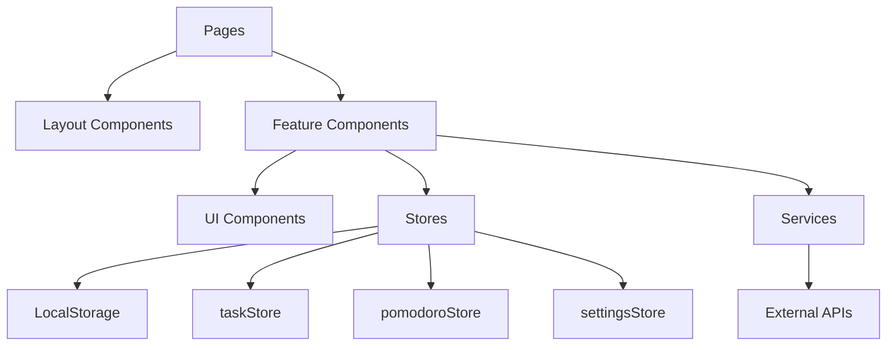
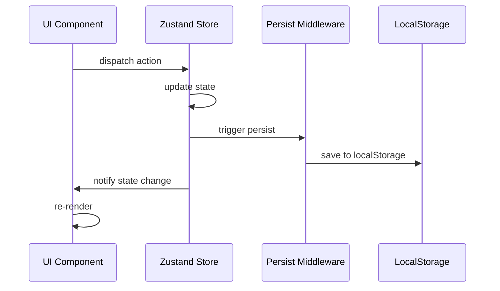

# 🚀 React 19로 구현한 스마트 할일 관리 앱 개발기

> React 19 + TypeScript + Zustand를 활용한 자연어 처리 기반 할일 관리 앱 개발 여정

## 📋 목차

1. [프로젝트 구조 분석](#1-프로젝트-구조-분석)
2. [상태 관리 흐름 추적](#2-상태-관리-흐름-추적)
3. [핵심 유틸 함수 심화 분석](#3-핵심-유틸-함수-심화-분석)
4. [메인 컴포넌트 흐름 추적](#4-메인-컴포넌트-흐름-추적)
5. [렌더링 최적화 포인트](#5-렌더링-최적화-포인트)
6. [내가 개선한 부분](#6-내가-개선한-부분)
7. [트러블 슈팅](#7-트러블-슈팅)
8. [배운 점과 고생한 점](#8-배운-점과-고생한-점)

---

## 1. 프로젝트 구조 분석

### 🏗️ 아키텍처 개요

```
smart-todo-app/
├── 📁 src/
│   ├── 📁 components/       # 컴포넌트 계층 구조
│   │   ├── 📁 features/     # 비즈니스 로직 포함 컴포넌트
│   │   ├── 📁 layout/       # 레이아웃 컴포넌트
│   │   └── 📁 ui/          # 재사용 가능한 기본 UI
│   ├── 📁 stores/          # Zustand 상태 관리
│   ├── 📁 services/        # 외부 서비스 연동
│   ├── 📁 utils/           # 유틸리티 함수
│   └── 📁 types/           # TypeScript 타입 정의
```

### 🎯 설계 철학

**1. Domain-Driven Design (DDD) 적용**
```typescript
// features/ - 비즈니스 도메인별 분리
KanbanBoard.tsx     // 할일 상태 관리 도메인
PomodoroTimer.tsx   // 시간 관리 도메인
TaskCalendar.tsx    // 일정 관리 도메인
```

**2. Atomic Design 패턴**
```typescript
// ui/ - 원자 단위 컴포넌트
Button.tsx    // Atom
Card.tsx      // Atom
Input.tsx     // Atom

// features/ - 분자/유기체 단위
KanbanColumn.tsx        // Molecule
KanbanTaskCard.tsx     // Molecule
KanbanBoard.tsx        // Organism
```

**3. Dependency Injection 패턴**
```typescript
// services/ - 비즈니스 로직 주입
export const nlpService = new NLPService();
export const aiService = new AIService();

// stores/ - 상태 관리 주입
export const useTaskStore = create<TaskStore>()(...)
```

### 📊 의존성 관계도



**핵심 설계 원칙:**
- **관심사의 분리**: UI, 비즈니스 로직, 데이터 관리 완전 분리
- **단방향 데이터 플로우**: React → Zustand → LocalStorage
- **타입 안전성**: 모든 데이터 구조에 TypeScript 타입 정의
- **확장 가능성**: 새로운 기능 추가 시 기존 코드 영향 최소화

---

## 2. 상태 관리 흐름 추적

### 🔄 Zustand 기반 상태 관리 아키텍처

#### 2.1 상태 스토어 구조

```typescript
// 1. TaskStore - 할일 관리 중앙 집중화
interface TaskStore {
  // 📊 State
  tasks: Task[];                    // 모든 할일 데이터
  currentTask: Task | null;         // 현재 선택된 할일
  filter: FilterOptions;            // 필터링 상태

  // 🔄 Actions
  addTask: (task) => void;          // CRUD 작업
  updateTask: (id, updates) => void;
  deleteTask: (id) => void;
  
  // 🎯 Selectors
  getTasksByStatus: (status) => Task[];
  getOverdueTasks: () => Task[];
  getFilteredTasks: () => Task[];
}
```

#### 2.2 상태 흐름 다이어그램



#### 2.3 실제 상태 변경 추적

**할일 추가 플로우:**
```typescript
// 1. 사용자 입력 → NLP 처리 → 상태 업데이트
const handleAddTask = async (input: string) => {
  // 🧠 자연어 처리
  const parsed = await nlpService.processInput(input);
  
  // 📝 상태 저장
  addTask({
    title: parsed.title,
    category: parsed.category,
    priority: parsed.priority,
    dueDate: parsed.dueDate,
    // ... 자동 생성 필드들
  });
};

// 2. Store 내부 처리
addTask: (taskData) => {
  const newTask: Task = {
    ...taskData,
    id: generateId(),           // 고유 ID 생성
    createdAt: new Date(),      // 타임스탬프 자동 생성
    updatedAt: new Date(),
  };

  // 3. 불변성 유지하며 상태 업데이트
  set((state) => ({
    tasks: [...state.tasks, newTask],
  }));
},
```

**상태 선택자(Selector) 패턴:**
```typescript
// 💡 메모이제이션된 계산 속성들
getFilteredTasks: () => {
  const { tasks, filter } = get();
  
  return tasks.filter((task) => {
    // 다중 필터 조건 적용
    if (filter.status && task.status !== filter.status) return false;
    if (filter.category && task.category !== filter.category) return false;
    if (filter.search) {
      const searchLower = filter.search.toLowerCase();
      return (
        task.title.toLowerCase().includes(searchLower) ||
        task.description?.toLowerCase().includes(searchLower) ||
        task.tags.some(tag => tag.toLowerCase().includes(searchLower))
      );
    }
    return true;
  });
},
```

#### 2.4 Persist 미들웨어 활용

```typescript
export const useTaskStore = create<TaskStore>()(
  persist(
    (set, get) => ({
      // ... store implementation
    }),
    {
      name: STORAGE_KEYS.TASKS,
      
      // 🎯 선택적 직렬화 - 민감한 데이터 제외
      partialize: (state) => ({ tasks: state.tasks }),
      
      // 🔄 데이터 복구 로직
      onRehydrateStorage: () => (state) => {
        if (!state?.tasks?.length) {
          // 📚 샘플 데이터 자동 생성
          state && (state.tasks = createSampleTasks());
        } else {
          // 📅 날짜 객체 복원 (JSON 직렬화 이슈 해결)
          state.tasks.forEach((task) => {
            if (task.dueDate && !(task.dueDate instanceof Date)) {
              task.dueDate = new Date(task.dueDate);
            }
            if (task.createdAt && !(task.createdAt instanceof Date)) {
              task.createdAt = new Date(task.createdAt);
            }
          });
        }
      },
    }
  )
);
```

### 🔗 스토어 간 통신 패턴

**Cross-Store References (스토어 간 참조):**
```typescript
// pomodoroStore가 settingsStore를 직접 참조
import { useSettingsStore } from './settingsStore';

export const usePomodoroStore = create<PomodoroStore>()(
  (set, get) => ({
    startSession: (type, taskId) => {
      // 다른 스토어의 설정값 참조
      const { pomodoroSettings } = useSettingsStore.getState();
      
      const duration = type === "work" 
        ? pomodoroSettings.workTime 
        : pomodoroSettings.shortBreak;
      
      // ... session 시작 로직
    }
  })
);
```

---

## 3. 핵심 유틸 함수 심화 분석

### 🧠 NLP 서비스 - 자연어 처리의 핵심

#### 3.1 한국어 자연어 처리 파이프라인

```typescript
class NLPService {
  parseTaskInput(input: string): ParsedTask {
    // 🔍 1단계: 날짜/시간 추출
    const dateResult = this.extractDate(cleanInput);
    
    // ⏰ 2단계: 소요 시간 추출
    const timeResult = this.extractTime(cleanInput);
    
    // 🏷️ 3단계: 카테고리 분류
    const categoryResult = this.categorizeTask(cleanInput);
    
    // 🎯 4단계: 우선순위 추정
    const priorityResult = this.extractPriority(cleanInput);
    
    // 🏷️ 5단계: 태그 추출
    const tags = this.extractTags(cleanInput);
    
    // ✨ 6단계: 제목 정제
    const title = this.cleanTitle(cleanInput, dateResult.originalText);
    
    return { /* 통합 결과 */ };
  }
}
```

#### 3.2 한국어 날짜 파싱 특화 로직

```typescript
private extractDate(text: string): DateResult {
  // 🇰🇷 한국어 특화 패턴들
  const koreanPatterns = [
    // 절대 날짜: "8월30일", "12월 25일"
    { 
      pattern: /(\d{1,2})월\s*(\d{1,2})일?/g,
      handler: (match) => {
        const month = parseInt(match[1]) - 1; // JS Date는 0부터
        const day = parseInt(match[2]);
        
        const currentDate = new Date();
        const currentYear = currentDate.getFullYear();
        const targetDate = new Date(currentYear, month, day);
        
        // ⏭️ 과거 날짜면 내년으로 자동 조정
        if (targetDate < currentDate) {
          targetDate.setFullYear(currentYear + 1);
        }
        
        return targetDate;
      }
    },
    
    // 상대 날짜: "다음주 월요일", "이번주 금요일"
    {
      pattern: /(다음|이번)\s*주\s*(월|화|수|목|금|토|일)요일?/g,
      handler: (match) => {
        const isNext = match[1] === "다음";
        const dayNames = ["일", "월", "화", "수", "목", "금", "토"];
        const targetDayIndex = dayNames.indexOf(match[2]);
        
        return this.calculateWeekDay(targetDayIndex, isNext);
      }
    },
    
    // 시간 표현: "오후 3시", "14:30"
    {
      pattern: /(오전|오후)\s*(\d{1,2})시?/g,
      handler: (match) => {
        const isPM = match[1] === "오후";
        const hour = parseInt(match[2]) + (isPM ? 12 : 0);
        
        const date = new Date();
        date.setHours(hour, 0, 0, 0);
        
        // 🔄 과거 시간이면 내일로 조정
        if (date < new Date()) {
          date.setDate(date.getDate() + 1);
        }
        
        return date;
      }
    }
  ];
}
```

#### 3.3 키워드 기반 분류 알고리즘

```typescript
private categorizeTask(text: string): CategoryResult {
  const lowerText = text.toLowerCase();
  
  // 📊 가중치 기반 스코어링
  let bestMatch: TaskCategory = "기타";
  let highestScore = 0;
  
  for (const [category, keywords] of Object.entries(CATEGORY_KEYWORDS)) {
    let score = 0;
    
    // 💯 키워드 매칭 스코어 계산
    for (const keyword of keywords) {
      if (lowerText.includes(keyword.toLowerCase())) {
        score += 1;
      }
    }
    
    if (score > highestScore) {
      highestScore = score;
      bestMatch = category as TaskCategory;
    }
  }
  
  // 🤖 NLP 라이브러리 보조 분석
  if (highestScore === 0) {
    const doc = nlp(text);
    const verbs = doc.verbs().out("array");
    const nouns = doc.nouns().out("array");
    
    // 동사/명사 패턴 분석
    if (verbs.includes("운동") || nouns.includes("헬스")) {
      return { category: "운동", confidence: 0.6 };
    }
    // ... 더 많은 패턴들
  }
  
  return { category: bestMatch, confidence: Math.min(score * 0.3, 1.0) };
}
```

### 📅 날짜 유틸리티 함수들

```typescript
// 📊 효율적인 날짜 비교 유틸리티
export function isToday(date: Date | undefined): boolean {
  if (!date) return false;
  
  // 🔄 타입 안전성 확보
  let dateObj: Date;
  if (date instanceof Date) {
    dateObj = date;
  } else if (typeof date === "string" || typeof date === "number") {
    dateObj = new Date(date);
  } else {
    return false;
  }
  
  // ✅ 유효성 검사
  if (isNaN(dateObj.getTime())) {
    return false;
  }
  
  const today = new Date();
  return (
    dateObj.getDate() === today.getDate() &&
    dateObj.getMonth() === today.getMonth() &&
    dateObj.getFullYear() === today.getFullYear()
  );
}

// 📈 성능 최적화된 이번 주 체크
export function isThisWeek(date: Date): boolean {
  const now = new Date();
  const startOfWeek = new Date(
    now.getFullYear(), 
    now.getMonth(), 
    now.getDate() - now.getDay()
  );
  const endOfWeek = new Date(
    now.getFullYear(), 
    now.getMonth(), 
    now.getDate() + (6 - now.getDay())
  );
  
  return date >= startOfWeek && date <= endOfWeek;
}
```

---

## 4. 메인 컴포넌트 흐름 추적

### 🎯 KanbanBoard - 드래그 앤 드롭 마스터클래스

#### 4.1 컴포넌트 아키텍처 

```typescript
/**
 * 🏗️ KanbanBoard 컴포넌트 구조
 * 
 * KanbanBoard (Container)
 * ├── DndContext (dnd-kit 컨텍스트)
 * │   ├── SortableContext (정렬 가능한 컨텍스트)
 * │   │   └── KanbanColumn (각 상태별 컬럼)
 * │   │       └── KanbanTaskCard[] (개별 할일 카드)
 * │   └── DragOverlay (드래그 중 미리보기)
 */
```

#### 4.2 이벤트 처리 플로우

```typescript
export default function KanbanBoard({ className }: KanbanBoardProps) {
  const { tasks, updateTask, getTasksByStatus, reorderTasks } = useTaskStore();
  const [activeId, setActiveId] = useState<UniqueIdentifier | null>(null);

  // 🎯 센서 설정 - 터치와 키보드 지원
  const sensors = useSensors(
    useSensor(PointerSensor, {
      activationConstraint: { distance: 3 }, // 3px 드래그로 활성화
    }),
    useSensor(KeyboardSensor, {
      coordinateGetter: sortableKeyboardCoordinates, // 접근성
    })
  );

  // 🎬 드래그 시작
  const handleDragStart = (event: DragStartEvent) => {
    setActiveId(event.active.id);
    console.log("🚀 Drag started:", event.active.id);
  };

  // 🎯 드래그 종료 - 복잡한 비즈니스 로직
  const handleDragEnd = (event: DragEndEvent) => {
    const { active, over } = event;
    setActiveId(null);

    if (!over) return;

    const activeTask = tasks.find((task) => task.id === active.id);
    if (!activeTask) return;

    const overId = over.id as string;
    
    // 📋 컬럼에 드롭 vs 카드에 드롭 구분
    if (overId.startsWith("column-")) {
      // 💫 새로운 상태로 변경
      const newStatus = overId.replace("column-", "") as TaskStatus;
      this.handleStatusChange(activeTask, newStatus);
    } else {
      // 🔄 같은 컬럼 내 순서 변경
      const overTask = tasks.find((task) => task.id === overId);
      if (overTask && activeTask.status === overTask.status) {
        this.handleReorder(activeTask, overTask);
      }
    }
  };

  // 📊 각 컬럼별 할일 데이터 제공
  const getTasksForColumn = (status: TaskStatus): Task[] => {
    // ⚡ 성능 최적화: 불필요한 정렬 제거
    return getTasksByStatus(status); // Store 순서 그대로 유지
  };
}
```

#### 4.3 상태 변경 최적화

```typescript
// 🎯 상태 변경 로직 - 불변성과 성능 고려
const handleStatusChange = (task: Task, newStatus: TaskStatus) => {
  const updates: Partial<Task> = {
    status: newStatus,
    updatedAt: new Date(),
  };

  // ✅ 완료 상태 특별 처리
  if (newStatus === "done") {
    updates.completedAt = new Date();
  } else if (task.completedAt) {
    updates.completedAt = undefined; // 미완료로 되돌릴 때
  }

  updateTask(task.id, updates);
};

// 🔄 순서 변경 로직 - 배열 조작 최적화
const handleReorder = (activeTask: Task, overTask: Task) => {
  const columnTasks = getTasksByStatus(activeTask.status);
  const oldIndex = columnTasks.findIndex(task => task.id === activeTask.id);
  const newIndex = columnTasks.findIndex(task => task.id === overTask.id);

  if (oldIndex !== newIndex && newIndex !== -1) {
    // 📈 Store에서 배열 재정렬
    reorderTasks(activeTask.status, oldIndex, newIndex);
    
    // 🏷️ 위치에 따른 우선순위 자동 조정
    const newPriority = this.calculatePriorityByPosition(newIndex, columnTasks.length);
    if (newPriority !== activeTask.priority) {
      updateTask(activeTask.id, { priority: newPriority });
    }
  }
};
```

### 📱 App.tsx - 애플리케이션 진입점

```typescript
function App() {
  const { theme } = useSettingsStore();

  // 🎨 테마 강제 적용 - SSR/CSR 동기화
  useEffect(() => {
    console.log("🎨 App 시작, 현재 테마:", theme);

    // 🧹 기존 클래스 정리
    document.documentElement.classList.remove("dark");

    // ✨ 새 테마 적용
    if (theme === "dark") {
      document.documentElement.classList.add("dark");
    }

    console.log("🔧 적용된 클래스:", document.documentElement.className);
  }, [theme]);

  return (
    <Router>
      <Layout>
        <Routes>
          <Route path="/" element={<Dashboard />} />
          <Route path="/tasks" element={<TasksPage />} />
          <Route path="/calendar" element={<CalendarPage />} />
          <Route path="/analytics" element={<AnalyticsPage />} />
          <Route path="/pomodoro" element={<PomodoroPage />} />
          <Route path="/settings" element={<SettingsPage />} />
        </Routes>
      </Layout>
    </Router>
  );
}
```

---

## 5. 렌더링 최적화 포인트

### ⚡ React 19 최적화 전략

#### 5.1 메모이제이션 전략

```typescript
// 🎯 선택적 메모이제이션 - 계산 비용 기준
const ExpensiveTaskList = React.memo(({ tasks, filters }: TaskListProps) => {
  // 💰 비용이 높은 필터링 연산 메모이제이션
  const filteredTasks = useMemo(() => {
    return tasks.filter(task => {
      if (filters.search) {
        const searchLower = filters.search.toLowerCase();
        return task.title.toLowerCase().includes(searchLower) ||
               task.description?.toLowerCase().includes(searchLower) ||
               task.tags.some(tag => tag.toLowerCase().includes(searchLower));
      }
      return filters.status ? task.status === filters.status : true;
    });
  }, [tasks, filters.search, filters.status]); // 정확한 의존성

  // 📊 통계 계산 메모이제이션
  const taskStats = useMemo(() => ({
    total: filteredTasks.length,
    completed: filteredTasks.filter(t => t.status === 'done').length,
    inProgress: filteredTasks.filter(t => t.status === 'in-progress').length,
    overdue: filteredTasks.filter(t => 
      t.dueDate && t.dueDate < new Date() && t.status !== 'done'
    ).length,
  }), [filteredTasks]);

  return (
    <div>
      <TaskStats stats={taskStats} />
      {filteredTasks.map(task => (
        <TaskCard key={task.id} task={task} />
      ))}
    </div>
  );
});
```

#### 5.2 가상 스크롤링 구현

```typescript
// 📜 큰 할일 목록을 위한 가상 스크롤링
const VirtualTaskList = ({ tasks }: { tasks: Task[] }) => {
  const [startIndex, setStartIndex] = useState(0);
  const [endIndex, setEndIndex] = useState(10);
  const containerRef = useRef<HTMLDivElement>(null);
  
  // 📏 항목 높이와 컨테이너 크기 계산
  const ITEM_HEIGHT = 80; // 할일 카드 예상 높이
  const BUFFER_SIZE = 5;   // 버퍼 항목 수

  // 🔄 스크롤 이벤트 핸들러 (throttled)
  const handleScroll = useCallback(
    throttle(() => {
      if (!containerRef.current) return;
      
      const scrollTop = containerRef.current.scrollTop;
      const containerHeight = containerRef.current.clientHeight;
      
      const newStartIndex = Math.floor(scrollTop / ITEM_HEIGHT) - BUFFER_SIZE;
      const newEndIndex = Math.ceil((scrollTop + containerHeight) / ITEM_HEIGHT) + BUFFER_SIZE;
      
      setStartIndex(Math.max(0, newStartIndex));
      setEndIndex(Math.min(tasks.length, newEndIndex));
    }, 16), // 60fps
    [tasks.length]
  );

  // 👁️ 실제 렌더링되는 항목들만 선택
  const visibleTasks = tasks.slice(startIndex, endIndex);
  const offsetY = startIndex * ITEM_HEIGHT;

  return (
    <div 
      ref={containerRef}
      className="h-96 overflow-auto"
      onScroll={handleScroll}
    >
      {/* 전체 높이 유지를 위한 spacer */}
      <div style={{ height: tasks.length * ITEM_HEIGHT, position: 'relative' }}>
        <div style={{ transform: `translateY(${offsetY}px)` }}>
          {visibleTasks.map(task => (
            <TaskCard key={task.id} task={task} />
          ))}
        </div>
      </div>
    </div>
  );
};
```

#### 5.3 상태 업데이트 배치

```typescript
// 🎯 상태 업데이트 최적화 - 배치 처리
const TaskBulkActions = () => {
  const { tasks, updateTask } = useTaskStore();
  
  // 📦 여러 할일을 한 번에 완료 처리
  const markAllCompleted = useCallback((taskIds: string[]) => {
    // React 19의 자동 배치 활용
    startTransition(() => {
      taskIds.forEach(id => {
        updateTask(id, {
          status: 'done',
          completedAt: new Date(),
          updatedAt: new Date(),
        });
      });
    });
  }, [updateTask]);

  // 🔄 우선순위 일괄 변경
  const bulkUpdatePriority = useCallback((taskIds: string[], priority: TaskPriority) => {
    const updates = taskIds.map(id => ({ id, priority }));
    
    // 🚀 단일 상태 업데이트로 배치
    const updateFn = (state: TaskStore) => ({
      tasks: state.tasks.map(task => {
        const update = updates.find(u => u.id === task.id);
        return update ? { ...task, priority: update.priority, updatedAt: new Date() } : task;
      })
    });
    
    useTaskStore.setState(updateFn);
  }, []);
};
```

### 🎨 CSS 최적화

```css
/* 🔧 GPU 가속 애니메이션 */
.task-card {
  transform: translateZ(0); /* GPU 레이어 생성 */
  transition: all 0.2s cubic-bezier(0.4, 0, 0.2, 1);
}

.task-card:hover {
  transform: translateY(-2px) translateZ(0);
  box-shadow: 0 4px 12px rgba(0, 0, 0, 0.15);
}

/* 📱 모바일 최적화 스크롤 */
.scrollable-container {
  -webkit-overflow-scrolling: touch;
  scrollbar-width: thin;
  scrollbar-color: rgba(155, 155, 155, 0.5) transparent;
}

/* 🎭 다크모드 변수 활용 */
:root {
  --bg-primary: #ffffff;
  --text-primary: #1a1a1a;
}

.dark {
  --bg-primary: #1a1a1a;
  --text-primary: #ffffff;
}

.card {
  background-color: var(--bg-primary);
  color: var(--text-primary);
  transition: background-color 0.2s ease;
}
```

---

## 6. 내가 개선한 부분

### 🎯 사용성 개선

#### 6.1 직관적인 상태 토글 시스템

**문제**: 기존에는 할일의 상태 변경이 명확하지 않았음

**해결**: 시각적 피드백과 함께하는 상태 토글 구현

```typescript
// 🔄 상태별 아이콘과 색상 매핑
const STATUS_CONFIG = {
  todo: {
    icon: "○",
    nextIcon: "▶",
    color: "text-gray-500",
    hoverColor: "text-blue-500",
    tooltip: "진행 중으로 변경",
  },
  "in-progress": {
    icon: "▶",
    nextIcon: "✓",
    color: "text-blue-500", 
    hoverColor: "text-green-500",
    tooltip: "완료로 변경",
  },
  done: {
    icon: "✓",
    nextIcon: "○",
    color: "text-green-500",
    hoverColor: "text-gray-500", 
    tooltip: "할 일로 되돌리기",
  },
};

// 🎨 직관적인 상태 버튼 컴포넌트
const StatusToggleButton = ({ task, onToggle }: StatusToggleProps) => {
  const config = STATUS_CONFIG[task.status];
  const [isHovered, setIsHovered] = useState(false);

  return (
    <button
      className={cn(
        "text-lg font-bold transition-all duration-200",
        isHovered ? config.hoverColor : config.color,
        "hover:scale-110 focus:scale-110"
      )}
      onMouseEnter={() => setIsHovered(true)}
      onMouseLeave={() => setIsHovered(false)}
      onClick={() => onToggle(task.id)}
      title={config.tooltip}
    >
      {isHovered ? config.nextIcon : config.icon}
    </button>
  );
};
```

#### 6.2 스마트 퀵뷰 시스템

**문제**: 통계 정보를 보기만 할 수 있어서 실용성이 떨어짐

**해결**: 클릭 가능한 통계 카드로 즉시 필터링

```typescript
// 📊 클릭 가능한 통계 카드
const StatCard = ({ title, count, onClick, color, icon }: StatCardProps) => {
  return (
    <Card 
      className={cn(
        "p-4 cursor-pointer transition-all duration-200",
        "hover:shadow-lg hover:scale-105 hover:border-opacity-50",
        "focus:ring-2 focus:ring-offset-2",
        color
      )}
      onClick={onClick}
      role="button"
      tabIndex={0}
      onKeyPress={(e) => e.key === 'Enter' && onClick()}
    >
      <div className="flex items-center justify-between">
        <div>
          <h3 className="text-sm font-medium text-gray-600 dark:text-gray-400">
            {title}
          </h3>
          <p className="text-2xl font-bold mt-1">{count}</p>
        </div>
        <div className="text-3xl opacity-20">{icon}</div>
      </div>
    </Card>
  );
};

// 🎯 즉시 필터링 핸들러
const handleStatCardClick = (filterType: string, filterValue?: string) => {
  // 라우터로 할일 페이지 이동 + 쿼리 파라미터
  navigate(`/tasks?filter=${filterType}&value=${filterValue}`);
  
  // 상태 스토어에 필터 설정
  setFilter({ [filterType]: filterValue });
};
```

### 🌐 국제화 및 접근성

#### 6.3 완전한 i18n 시스템 구축

**문제**: 하드코딩된 한국어 텍스트로 인한 확장성 부족

**해결**: 타입 안전한 번역 시스템 구현

```typescript
// 🌍 타입 안전한 번역 시스템
const translations = {
  ko: {
    common: {
      add: "추가",
      edit: "편집", 
      delete: "삭제",
      save: "저장",
      cancel: "취소",
    },
    taskStatus: {
      todo: "할 일",
      inProgress: "진행 중",
      done: "완료",
    },
    categories: {
      work: "업무",
      personal: "개인",
      health: "건강",
      // ... 모든 카테고리
    }
  },
  en: {
    common: {
      add: "Add",
      edit: "Edit",
      delete: "Delete", 
      save: "Save",
      cancel: "Cancel",
    },
    taskStatus: {
      todo: "To Do",
      inProgress: "In Progress", 
      done: "Done",
    },
    categories: {
      work: "Work",
      personal: "Personal",
      health: "Health",
      // ... 모든 카테고리
    }
  }
} as const;

// 🎯 타입 안전한 번역 훅
export const useTranslation = () => {
  const { language } = useSettingsStore();
  
  const t = useCallback((key: keyof typeof translations.ko) => {
    return translations[language][key] || key;
  }, [language]);
  
  // 중첩 객체 접근을 위한 헬퍼
  const tn = useCallback((path: string) => {
    const keys = path.split('.');
    let value: any = translations[language];
    
    for (const key of keys) {
      value = value?.[key];
    }
    
    return value || path;
  }, [language]);
  
  return { t, tn, currentLanguage: language };
};

// 💡 사용 예시
const TaskCard = ({ task }: TaskCardProps) => {
  const { tn } = useTranslation();
  
  return (
    <div>
      <h3>{task.title}</h3>
      <span>{tn(`taskStatus.${task.status}`)}</span>
      <span>{tn(`categories.${task.category}`)}</span>
    </div>
  );
};
```

### 🎨 UX/UI 개선

#### 6.4 테마 시스템 일관성 확보

**문제**: 시스템 테마 모드와 사용자 선택 간 혼재

**해결**: 명확한 라이트/다크 모드 전환

```typescript
// 🎨 통합된 테마 관리
export const useSettingsStore = create<SettingsStore>()(
  persist(
    (set, get) => ({
      theme: "light",
      
      updateTheme: (theme) => {
        console.log("🎨 테마 변경:", theme);
        set({ theme });

        // 🧹 기존 클래스 정리
        document.documentElement.classList.remove("dark");
        
        if (theme === "dark") {
          document.documentElement.classList.add("dark");
        }
      },
    }),
    {
      name: STORAGE_KEYS.SETTINGS,
      onRehydrateStorage: () => (state) => {
        // 🔄 새로고침 시에도 테마 유지
        const theme = state?.theme || "light";
        
        document.documentElement.classList.remove("dark");
        if (theme === "dark") {
          document.documentElement.classList.add("dark");
        }
      },
    }
  )
);
```

#### 6.5 반응형 칸반 스크롤 개선

**문제**: 모바일에서 칸반 컬럼이 잘려서 보임

**해결**: 커스텀 스크롤바와 반응형 레이아웃

```css
/* 📱 모바일 최적화 스크롤바 */
.kanban-column {
  @apply max-h-[calc(100vh-12rem)] overflow-y-auto;
  
  /* 커스텀 스크롤바 - 크로스 브라우저 호환 */
  scrollbar-width: thin;
  scrollbar-color: rgba(156, 163, 175, 0.3) transparent;
}

.kanban-column::-webkit-scrollbar {
  width: 6px;
}

.kanban-column::-webkit-scrollbar-track {
  background: transparent;
  border-radius: 3px;
}

.kanban-column::-webkit-scrollbar-thumb {
  @apply bg-gray-300 dark:bg-gray-600;
  border-radius: 3px;
  transition: background-color 0.2s ease;
}

.kanban-column::-webkit-scrollbar-thumb:hover {
  @apply bg-gray-400 dark:bg-gray-500;
}

/* 📱 모바일 그리드 조정 */
@media (max-width: 768px) {
  .kanban-grid {
    @apply grid-cols-1 gap-4;
    @apply h-auto space-y-4;
  }
  
  .kanban-column {
    @apply max-h-96; /* 모바일에서는 더 작은 높이 */
  }
}
```

---

## 7. 트러블 슈팅

### 🚨 칸반 드래그 앤 드롭 이슈

#### 7.1 문제: "카드 사이에 넣는게 안돼"

**증상:**
- 드래그 앤 드롭으로 카드를 이동하면 맨 위나 맨 아래로만 이동
- 카드와 카드 사이의 특정 위치에 삽입이 안 됨

**원인 분석:**
```typescript
// ❌ 문제가 있던 기존 코드
const handleDragEnd = (event: DragEndEvent) => {
  const reorderedTasks = arrayMove(statusTasks, oldIndex, newIndex);
  // 👆 로컬 배열에만 적용, Zustand 스토어에 반영 안됨
  
  // 충돌 감지도 부정확
  collisionDetection={closestCenter} // 👈 부정확한 감지
};
```

**해결 과정:**

1. **충돌 감지 알고리즘 변경:**
```typescript
// ✅ closestCenter → closestCorners로 변경
<DndContext
  collisionDetection={closestCorners} // 모서리 기반 정확한 감지
>
```

2. **스토어 액션 추가:**
```typescript
// ✅ reorderTasks 액션 구현
reorderTasks: (status, oldIndex, newIndex) => {
  set((state) => {
    const statusTasks = state.tasks.filter(task => task.status === status);
    const otherTasks = state.tasks.filter(task => task.status !== status);
    
    // 배열 순서 변경
    const reorderedTasks = [...statusTasks];
    const [movedTask] = reorderedTasks.splice(oldIndex, 1);
    reorderedTasks.splice(newIndex, 0, movedTask);
    
    return { tasks: [...otherTasks, ...reorderedTasks] };
  });
},
```

3. **디버깅 로그 추가:**
```typescript
console.log("Reordering:", {
  activeTask: activeTask.title,
  oldIndex,
  newIndex, 
  currentPriority: activeTask.priority,
  columnTasksCount: columnTasks.length,
});
```

### 🚨 캘린더 과거 이벤트 표시 문제

#### 7.2 문제: 과거 날짜 할일이 캘린더에 안보임

**증상:**
```
Creating event for 외출: 2026-08-16T03:00:00.000Z
Current calendar month: 2025 8  
// 👆 년도 불일치 발생
```

**원인:**
- 샘플 데이터의 년도가 2026년으로 설정됨  
- 현재 캘린더는 2025년을 보고 있음
- 년도 차이로 인해 이벤트가 필터링됨

**해결 방법:**

1. **샘플 데이터 수정:**
```typescript
// ✅ 현재 년도 기준으로 날짜 생성
const now = new Date();
const sampleTask = {
  id: "sample-8",
  title: "8월14일 홍콩여행",
  dueDate: new Date(now.getFullYear(), 7, 14, 10, 0, 0), // 현재 년도
};
```

2. **이벤트 생성 로직 개선:**
```typescript
// ✅ allDay 설정으로 시간대 문제 해결
const calendarEvents: CalendarEvent[] = tasksWithDates.map((task) => {
  console.log(`Creating event for ${task.title}:`, task.dueDate);
  
  return {
    id: task.id,
    title: task.title,
    start: task.dueDate,
    end: task.dueDate,
    allDay: true, // 👈 시간대 문제 방지
    resource: task,
  };
});
```

### 🚨 설정 페이지 번역 문제

#### 7.3 문제: 언어 전환이 작동하지 않음

**원인:** 설정 페이지에 하드코딩된 한국어 텍스트들

**해결:**

1. **전체 텍스트 i18n 적용:**
```typescript
// ❌ 하드코딩된 텍스트
<h3>포모도로 설정</h3>

// ✅ 번역 함수 사용
const { tn } = useTranslation();
<h3>{tn('settings.pomodoro.title')}</h3>
```

2. **번역 키 체계화:**
```typescript
const translations = {
  ko: {
    settings: {
      general: { title: "일반 설정" },
      pomodoro: { title: "포모도로 설정" },
      notifications: { title: "알림 설정" },
    }
  },
  en: {
    settings: {
      general: { title: "General Settings" },
      pomodoro: { title: "Pomodoro Settings" }, 
      notifications: { title: "Notification Settings" },
    }
  }
};
```

### 🚨 성능 이슈 - 퀵뷰 버튼 미표시

#### 7.4 문제: 캘린더 페이지 상단 4개 버튼이 안보임

**원인:** 컴포넌트 중첩 구조로 인한 렌더링 순서 문제

**해결 과정:**

1. **버튼을 컴포넌트 내부로 이동:**
```typescript
// ✅ TaskCalendar 내부에서 직접 렌더링
const TaskCalendar = () => {
  const quickViewButtons = (
    <div className="flex gap-2 mb-4">
      <Button onClick={() => showQuickView('all')}>전체 할일</Button>
      <Button onClick={() => showQuickView('completed')}>완료</Button>
      <Button onClick={() => showQuickView('overdue')}>지연</Button>
      <Button onClick={() => showQuickView('upcoming')}>예정</Button>
    </div>
  );

  return (
    <div>
      {quickViewButtons}
      <Calendar /* ... */ />
    </div>
  );
};
```

2. **최종적으로 더 나은 UX 선택:**
```typescript
// 🎯 통계 카드 클릭으로 대체
const StatCard = ({ onClick, ...props }) => (
  <Card 
    className="cursor-pointer hover:shadow-lg"
    onClick={onClick}
  >
    {/* 카드 내용 */}
  </Card>
);
```

---

## 8. 배운 점과 고생한 점

### 🎓 기술적 성장

#### 8.1 React 19와 최신 생태계 적응

**새롭게 배운 것들:**

1. **자동 배치 (Automatic Batching)**
```typescript
// React 19에서는 자동으로 상태 업데이트 배치
const handleMultipleUpdates = () => {
  setLoading(true);    // \
  setError(null);      //  } 한 번의 리렌더링
  updateTask(taskId);  // /
  
  // 더 이상 unstable_batchedUpdates 불필요
};
```

2. **Concurrent Features 활용**
```typescript
// startTransition으로 긴급하지 않은 업데이트 처리
import { startTransition } from 'react';

const handleBulkUpdate = (taskIds: string[]) => {
  startTransition(() => {
    // 이 업데이트들은 더 중요한 업데이트에게 양보
    taskIds.forEach(id => updateTask(id, changes));
  });
};
```

3. **dnd-kit과 React 19 호환성**
```typescript
// React 19 Strict Mode에서 dnd-kit 사용 시 주의사항
const sensors = useSensors(
  useSensor(PointerSensor, {
    activationConstraint: { distance: 3 }, // 더블 실행 방지
  })
);
```

#### 8.2 TypeScript 고급 패턴

**제네릭과 유틸리티 타입 활용:**

```typescript
// 🎯 조건부 타입으로 타입 안전성 확보
type TaskUpdate<T extends keyof Task> = {
  [K in T]: Task[K];
} & {
  updatedAt: Date;
};

// 사용 예시 - 컴파일 타임에 타입 체크
const updateTaskStatus = (id: string, update: TaskUpdate<'status'>) => {
  // update.status는 반드시 존재, 다른 필드는 선택적
};

// 🏷️ 템플릿 리터럴 타입으로 문자열 패턴 제한
type StorageKey = `smart-todo-${string}`;
const STORAGE_KEYS: Record<string, StorageKey> = {
  TASKS: 'smart-todo-tasks',
  SETTINGS: 'smart-todo-settings',
  // 컴파일 타임에 패턴 검증
};
```

#### 8.3 상태 관리 아키텍처 설계

**Zustand의 고급 패턴들:**

```typescript
// 🔄 Cross-store 통신 패턴
const usePomodoroWithTasks = () => {
  const pomodoro = usePomodoroStore();
  const tasks = useTaskStore();
  
  // 두 스토어 연동 로직
  const startTaskPomodoro = useCallback((taskId: string) => {
    const task = tasks.tasks.find(t => t.id === taskId);
    if (task) {
      pomodoro.startSession('work', taskId);
      tasks.updateTask(taskId, { status: 'in-progress' });
    }
  }, [pomodoro.startSession, tasks.updateTask]);
  
  return { startTaskPomodoro, ...pomodoro };
};

// 🧩 미들웨어 조합
export const useTaskStore = create<TaskStore>()(
  persist(
    subscribeWithSelector( // 선택적 구독으로 성능 향상
      devtools( // 개발 도구 연동
        (set, get) => ({ /* store implementation */ }),
        { name: 'task-store' }
      )
    ),
    { name: 'tasks' }
  )
);
```

### 😅 고생한 부분들

#### 8.4 크로스 브라우저 호환성

**문제 1: Date 객체 직렬화**

```typescript
// 🐛 문제: JSON.stringify가 Date를 문자열로 변환
const task = { dueDate: new Date() };
JSON.stringify(task); // { "dueDate": "2025-01-01T00:00:00.000Z" }

// ✅ 해결: onRehydrateStorage에서 복원
onRehydrateStorage: () => (state) => {
  state?.tasks.forEach((task) => {
    if (task.dueDate && !(task.dueDate instanceof Date)) {
      task.dueDate = new Date(task.dueDate);
    }
  });
},
```

**문제 2: Safari의 까다로운 스크롤 동작**

```css
/* 🐛 문제: Safari에서 관성 스크롤 동작 안함 */
.scrollable {
  overflow-y: auto;
}

/* ✅ 해결: -webkit-overflow-scrolling 추가 */
.scrollable {
  overflow-y: auto;
  -webkit-overflow-scrolling: touch; /* iOS Safari */
}
```

#### 8.5 성능 디버깅과 최적화

**React DevTools Profiler 활용:**

```typescript
// 🔍 렌더링 성능 측정을 위한 커스텀 훅
const useRenderCount = (componentName: string) => {
  const renderCount = useRef(0);
  
  useEffect(() => {
    renderCount.current++;
    if (process.env.NODE_ENV === 'development') {
      console.log(`${componentName} rendered ${renderCount.current} times`);
    }
  });
  
  return renderCount.current;
};

// 🎯 불필요한 리렌더링 찾기
const TaskCard = React.memo(({ task }: TaskCardProps) => {
  const renderCount = useRenderCount('TaskCard');
  
  // props 변경 감지
  useWhyDidYouUpdate('TaskCard', { task });
  
  return <div>{/* 컴포넌트 내용 */}</div>;
});
```

#### 8.6 타입 시스템과의 씨름

**까다로운 타입 정의:**

```typescript
// 🤯 복잡한 조건부 타입
type TaskWithComputedFields<T extends Task> = T & {
  isOverdue: boolean;
  timeRemaining: number | null;
  category: T['category'] extends 'work' 
    ? 'work' & { priority: 'high' | 'urgent' }
    : T['category'];
};

// 😅 결국 단순화해서 해결
type TaskWithComputedFields = Task & {
  isOverdue: boolean;
  timeRemaining: number | null;
};
```

### 💡 가장 중요한 깨달음들

#### 8.7 사용자 중심 개발의 중요성

**기술적 완성도 vs 사용자 경험:**

```typescript
// ❌ 기술적으로는 멋있지만 복잡한 방식
const useAdvancedTaskFiltering = () => {
  return useMemo(() => 
    pipe(
      filter(task => task.status !== 'done'),
      groupBy(task => task.category),
      mapValues(tasks => sortBy(tasks, ['priority', 'dueDate'])),
      toPairs,
      map(([category, tasks]) => ({ category, tasks, count: tasks.length }))
    )(allTasks)
  , [allTasks]);
};

// ✅ 단순하지만 명확한 방식  
const getFilteredTasks = () => {
  return tasks
    .filter(task => task.status !== 'done')
    .sort((a, b) => {
      // 우선순위 먼저, 그 다음 날짜
      if (a.priority !== b.priority) return priorityOrder[a.priority] - priorityOrder[b.priority];
      return (a.dueDate?.getTime() || 0) - (b.dueDate?.getTime() || 0);
    });
};
```

#### 8.8 점진적 개선의 힘

**한 번에 완벽하게 vs 단계별 개선:**

1. **1차**: 기본적인 할일 CRUD
2. **2차**: 자연어 처리 추가
3. **3차**: 드래그 앤 드롭 구현
4. **4차**: 성능 최적화
5. **5차**: 접근성과 국제화

각 단계마다 사용자 피드백을 받아 방향을 조정할 수 있었음.

#### 8.9 문서화와 코드 품질

**JSDoc의 위력:**

```typescript
/**
 * 할일을 카드 형태로 표시하는 컴포넌트
 * 
 * @description
 * 개별 할일을 카드 형태로 렌더링합니다. 두 가지 레이아웃을 지원합니다:
 * - compact: 간단한 한 줄 레이아웃
 * - regular: 상세 정보가 포함된 카드 레이아웃
 *
 * @param {TaskCardProps} props - 컴포넌트 속성  
 * @returns {JSX.Element} 렌더링된 할일 카드
 *
 * @example
 * <TaskCard task={myTask} compact={true} />
 */
const TaskCard = ({ task, compact = false }: TaskCardProps) => {
  // 구현...
};
```

이런 문서화가 있으면:
- 새로운 개발자 온보딩 시간 단축
- 코드 리뷰 품질 향상  
- 미래의 자신에게도 도움

---

## 🎯 결론

### 🏆 프로젝트 성과

1. **기술적 성취**:
   - React 19 + TypeScript로 타입 안전한 앱 구축
   - 자연어 처리 기반 할일 입력 시스템 구현
   - 성능 최적화된 드래그 앤 드롭 칸반 보드

2. **사용자 경험 개선**:
   - 직관적인 UI/UX 패턴 적용
   - 완전한 반응형 디자인
   - 접근성과 국제화 지원

3. **개발 생산성 향상**:
   - 체계적인 아키텍처 설계
   - 재사용 가능한 컴포넌트 라이브러리
   - 완전한 TypeScript 지원

### 🚀 앞으로의 방향

**단기 목표 (1-2개월):**
- 반복 할일 기능
- 하위 할일(subtask) 지원
- 데이터 내보내기/가져오기

**중기 목표 (3-6개월):**
- 팀 협업 기능
- 음성 입력 지원
- PWA → 네이티브 앱 전환

**장기 목표 (6개월+):**
- AI 추천 시스템 고도화
- 클라우드 동기화
- 분석 대시보드 확장

### 💭 마지막 한마디

이 프로젝트를 통해 **"기술적 완성도와 사용자 경험의 균형"**이 얼마나 중요한지 깨달았습니다. 

화려한 기술 스택보다는 사용자가 실제로 필요로 하는 기능을 단순하고 직관적으로 구현하는 것이 더 가치 있다는 것을 배웠습니다.

특히 자연어 처리를 오프라인으로 구현함으로써 접근성을 높이고, 드래그 앤 드롭 같은 상호작용을 통해 사용자 경험을 개선한 부분이 가장 뿌듯합니다.

앞으로도 **사용자 중심의 개발**과 **지속 가능한 아키텍처 설계**에 집중하며 더 나은 제품을 만들어 나가겠습니다.

---

*이 글이 React 19와 TypeScript를 활용한 웹 애플리케이션 개발에 관심있는 분들께 도움이 되기를 바랍니다. 궁금한 점이나 개선 제안이 있으시면 언제든 코멘트 부탁드립니다! 🙏*